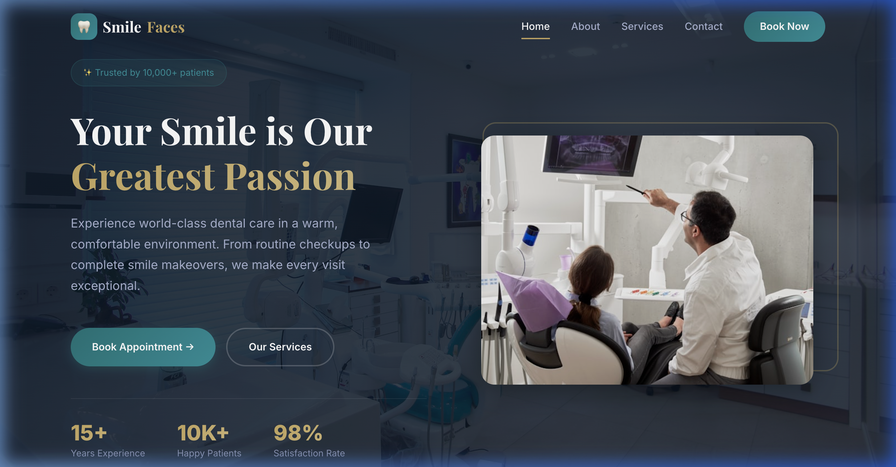

# 🦷 Smile Faces Dental Clinic

A modern, premium dental clinic website built with pure HTML, CSS, and JavaScript. Features a luxurious dark teal theme with gold accents, glassmorphism effects, smooth animations, and full mobile responsiveness.



## ✨ Features

- **5 Full Pages** — Home, About, Services, Contact, Appointments
- **Premium Dark Theme** — Navy/teal palette with gold accents
- **Glassmorphism UI** — Frosted glass card components
- **Scroll Animations** — Reveal-on-scroll using IntersectionObserver
- **Mobile Responsive** — Hamburger nav, adaptive grids, touch-friendly
- **Booking System** — Multi-step appointment form with time slot picker
- **FAQ Accordion** — Expandable questions & answers
- **Google Maps** — Embedded clinic location map
- **Real Photography** — All images sourced from Unsplash

## 🛠️ Tech Stack

| Technology | Usage |
|---|---|
| HTML5 | Semantic page structure |
| CSS3 | Custom properties, Grid, Flexbox, animations |
| JavaScript | DOM manipulation, IntersectionObserver, form validation |
| Google Fonts | Inter + Playfair Display typography |
| Unsplash | Real dental/medical photography |

## 📄 Pages

| Page | Description |
|---|---|
| `index.html` | Hero, stats bar, services grid, testimonials, CTA |
| `about.html` | Clinic story, core values, team members |
| `services.html` | 6 detailed service blocks with images |
| `contact.html` | Contact form, office hours, Google Maps |
| `appointments.html` | Step-by-step booking form, benefits, FAQ |

## 🚀 Getting Started

1. Clone the repository:
   ```bash
   git clone https://github.com/SonuSharmaFiles/smile-faces-dental-clinic.git
   ```
2. Open `index.html` in your browser — no build tools needed!

## 📁 Project Structure

```
Smile faces dental clinic/
├── index.html          # Homepage
├── about.html          # About Us
├── services.html       # Services
├── contact.html        # Contact
├── appointments.html   # Book Appointment
├── css/
│   └── style.css       # Complete design system
├── js/
│   └── main.js         # All interactions & animations
└── assets/
    └── images/         # Screenshots & assets
```

## 🎨 Design System

- **Primary:** `#0d7377` (Teal)
- **Accent:** `#c8a95e` (Gold)
- **Background:** `#0b1a2a` (Dark Navy)
- **Fonts:** Playfair Display (headings) + Inter (body)

## 📱 Responsive Breakpoints

- **Desktop:** 1024px+
- **Tablet:** 768px – 1024px
- **Mobile:** < 768px

## 📝 License

This project is open source and available under the [MIT License](LICENSE).

---

Made with ❤️ by **Sonu Sharma**
